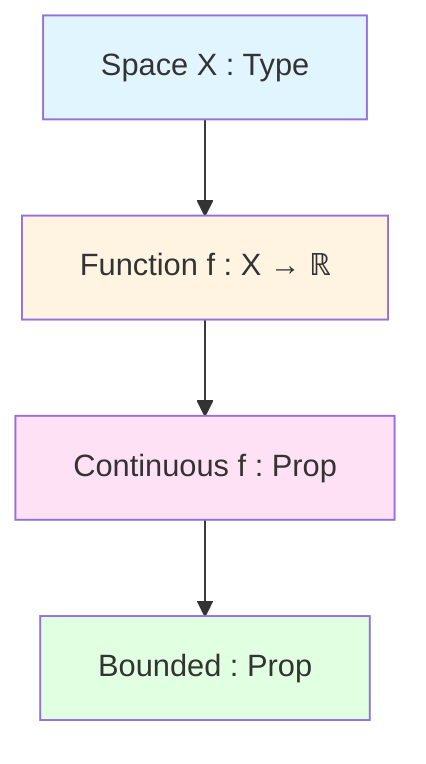
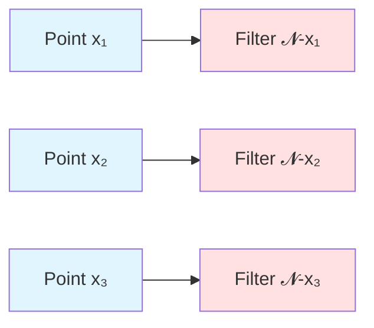
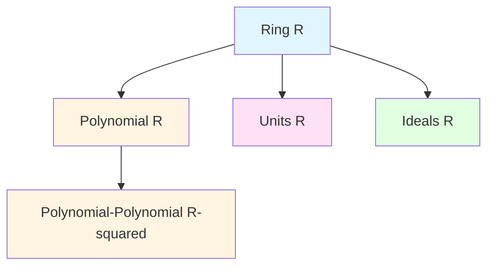
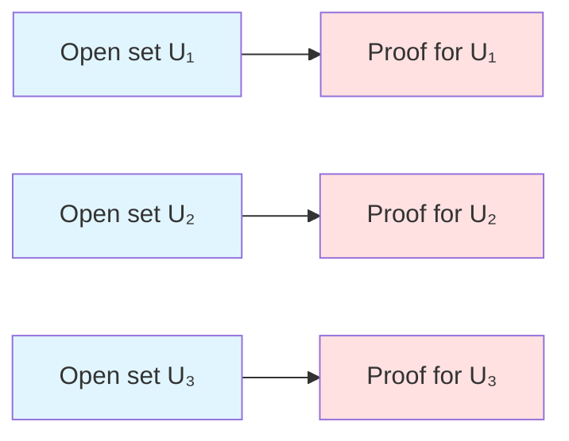
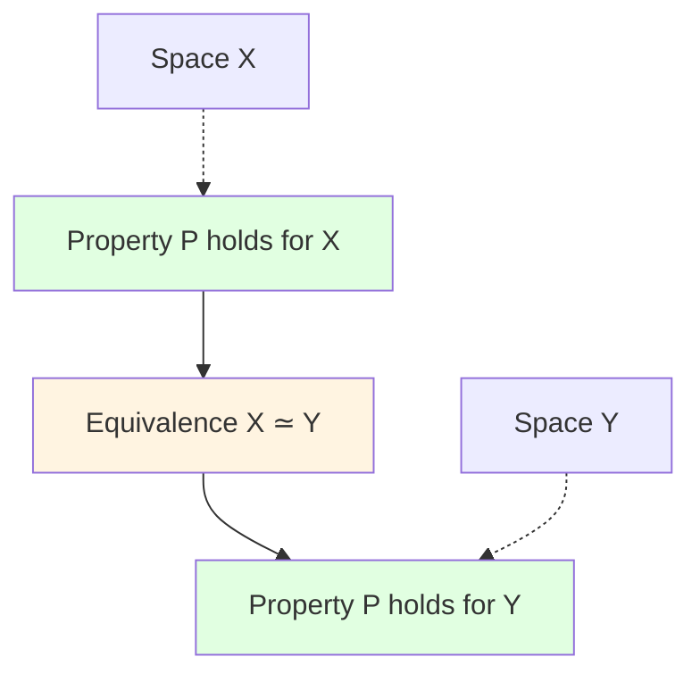
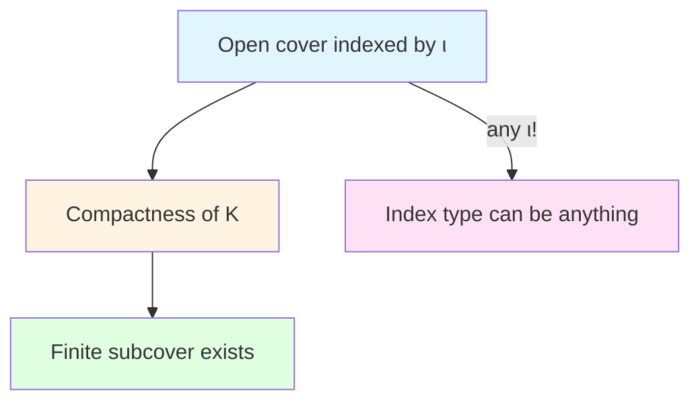
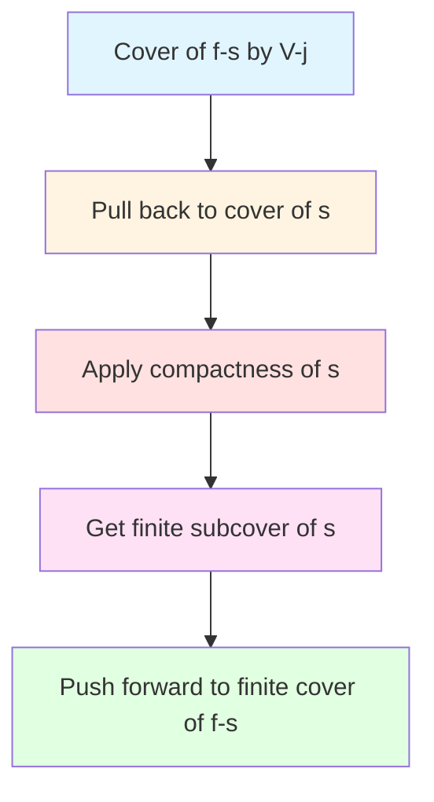

So here's the thing about learning Lean—at first, it feels like you're being asked to relearn mathematics in some weird computer science dialect. You open up the documentation, see terms like "dependent type theory" and "Calculus of Constructions," and think: *why can't I just write math the normal way*?

But then something clicks. You realize dependent types aren't some arbitrary programming language feature—they're actually expressing something that was always there in your mathematical thinking. You just never had a language explicit enough to see it.

Let me show you what I mean.

## Reading Lean: A Quick Survival Guide

Before we dive in, here's the absolute minimum you need to read Lean code. I promise it's simpler than it looks:

- `:` means "has type" (think of it like ∈ for sets)
- `→` means "implies" or "function from...to"
- `∀` means "for all" (yep, same as math!)
- `∃` means "there exists" (also the same!)
- `Type` is like the universe of mathematical objects
- `Prop` is the universe of propositions (true/false statements)

That's it. Seriously. The rest we'll pick up as we go.

## The Hook: Continuous Functions on Compact Spaces

Let's start with something concrete. You want to prove that every continuous function from a compact metric space to ℝ is bounded. Classic analysis theorem, right?

**Traditional math speak:**
> For all metric spaces X, if X is compact, and f : X → ℝ is continuous, then f is bounded.

**Lean:**
```lean
theorem continuous_on_compact_is_bounded 
  (X : Type)                    -- X is a type (our space)
  [MetricSpace X]               -- X has a metric space structure
  [CompactSpace X]              -- X is compact
  (f : X → ℝ)                   -- f is a function from X to ℝ
  (hf : Continuous f) :         -- hypothesis: f is continuous
  IsBounded (Set.range f)       -- conclusion: range of f is bounded
  := ...
```

Here's what blew my mind when I first saw this: `Continuous f` is a *type*, and it depends on `f`, which depends on `X`. We're building types on top of values. This isn't some compiler magic—it's the mathematical structure showing through.



The square brackets `[MetricSpace X]` tell Lean "figure out the metric from context"—it's like when you write "let X be a metric space" and everyone just knows what you mean.

## Types Are First-Class Citizens (And That's Wild)

In most programming languages, types exist only at compile-time. But in dependent type theory, **types are values**. You can pass them to functions, return them from functions, compute with them—they're real mathematical objects.

This is crucial. Consider what it means for a topological space to be Hausdorff:

**Math textbook:**
> A space X is Hausdorff if any two distinct points can be separated by disjoint open sets.

**Lean:**
```lean
class HausdorffSpace (X : Type) [TopologicalSpace X] : Prop where
  t2 : ∀ x y : X,                    -- for all points x, y in X
    x ≠ y →                          -- if they're distinct
    ∃ U V : Set X,                   -- there exist sets U and V
      IsOpen U ∧ IsOpen V ∧          -- both open
      x ∈ U ∧ y ∈ V ∧                -- containing x and y
      Disjoint U V                   -- and disjoint
```

Look at that `IsOpen U` line. That's not a check that returns true or false—it's a *type*. Specifically, it's `IsOpen : Set X → Prop`, a function that takes a set and returns a proposition (which is itself a type!).

**Here's the key insight:**
- `IsOpen U` is a type (a proposition type)
- A proof that U is open is a *term* of type `IsOpen U`
- Different sets give you different types

Types talking about types! This is exactly what we need for the hierarchical nature of mathematics.

## Type Families: The Structure Was Always There

You know how in topology, for each point x you have the neighborhood filter at x? Or in algebra, for each ring R you have the group of units R×? Those are **type families**—families of types indexed by values.

### Example: Neighborhoods in Topology

**Math notation:**
> 𝓝(x) = the neighborhood filter at x

**Lean:**
```lean
def nhds (x : X) [TopologicalSpace X] : Filter X := ...
     --  ↑ input: a point          ↑ output: a filter (type!)
```

This is a function from *values* (points) to *types* (filters). Different points, different filters. When we say "the sequence (aₙ) converges to x," we're really saying something that depends on which x we're talking about:

```lean
def Tendsto (f : ℕ → X) (x : X) : Prop :=
  Filter.Tendsto f Filter.atTop (nhds x)
  --                                  ↑
  --                            depends on x!
```



### Example: Units of a Ring

In algebra, we do this all the time without thinking about it:

**Math:**
> R× = invertible elements of R

**Lean:**
```lean
def Units (R : Type) [Ring R] : Type := 
  { u : R // IsUnit u }
```

Each ring gives you a different type:
- ℤ gives you `Units ℤ = {-1, 1}`
- ℤ/5ℤ gives you `Units (ℤ/5ℤ) = {1, 2, 3, 4}`

Same with polynomial rings:

```lean
def Polynomial (R : Type) [Ring R] : Type := ...
--               ↑ input: a ring      ↑ output: a type of polynomials
```



And we can keep going—polynomials of polynomials, ideals in polynomial rings. Types depending on types depending on types, as deep as we need.

## Universal Quantification Is Just Function Types (Mind Blown)

Here's where it gets really cool: **universal quantification is secretly just a function**.

A **dependent function type** `(x : A) → B x` means:
- Take an input `x` of type `A`
- Return an output of type `B x` (where the type can depend on `x`)

When `B x` doesn't actually depend on `x`, this is just a regular function `A → B`. But when it does depend, magic happens.

### Example: Continuity at a Point

**Standard definition:**
> f is continuous at x if for every open set U containing f(x), there exists an open set V containing x such that f(V) ⊆ U

**Lean:**
```lean
def ContinuousAt (f : X → Y) (x : X) : Prop :=
  ∀ U : Set Y,           -- for all sets U
    IsOpen U →           -- if U is open
    f x ∈ U →            -- and f(x) ∈ U
    ∃ V : Set X,         -- there exists V
      IsOpen V ∧         -- V is open
      x ∈ V ∧            -- x ∈ V
      f '' V ⊆ U         -- f(V) ⊆ U
```

That `∀ U : Set Y, ...` is really `(U : Set Y) → ...`—a function type!

**What this means:**
"Give me any set U, and I'll give you back a proof of the property."

The proof I construct depends on which U you give me. When we *prove* continuity, we're literally constructing a function that takes open sets as input and produces proofs as output.

**Side by side:**
```
Math:   ∀U open, f(x) ∈ U → ∃V open, x ∈ V ∧ f(V) ⊆ U
        ↕                    ↕
Lean:   (U : Set Y) →       (returns a proof that depends on U)
```



### Example: Group Homomorphisms

**Math:**
> f : G → H is a homomorphism if ∀a,b ∈ G, f(ab) = f(a)f(b)

**Lean:**
```lean
structure IsGroupHom (f : G → H) [Group G] [Group H] : Prop where
  map_mul : ∀ a b : G, f (a * b) = f a * f b
  --        ↑
  --        This is: (a : G) → (b : G) → (proof that ...)
```

To prove something is a homomorphism, we construct a function that, given any two elements a and b, produces a proof that f respects multiplication for those specific elements.

## Why This Actually Matters

Okay, so why should you care? Two huge reasons:

### 1. Precision

In traditional math, we rely on context. When I write "f is continuous," you implicitly know:
- Which topology on the domain?
- Which topology on the codomain?
- Everywhere or at a point?

Lean makes it all explicit:

```lean
ContinuousAt f x       -- continuous at point x
Continuous f           -- continuous everywhere
-- The type tells you exactly what's claimed!
```

This precision prevents errors. I can't prove the wrong thing because I misunderstood what "continuous" meant in this context.

### 2. Computation: Proofs Are Programs

In dependent type theory, **proofs are executable programs**. When you prove "∀ε > 0, ∃δ > 0...", you're constructing a *function* that takes ε and computes δ.

This means:
- Lean can check your proofs automatically
- You can extract algorithms from constructive proofs
- Type inference can fill in obvious details

**Example: Transporting Properties**

Say you've proved something about one space, then realize it's homeomorphic to another:

```lean
def Equiv.cast {P : Type → Prop} (e : X ≃ Y) (h : P X) : P Y := ...
--               ↑                  ↑           ↑         ↑
--            property          equiv.      proof    transported proof
```

That `P : Type → Prop` is a dependent function—it takes a *type* and returns a *proposition*!

This says: if you have a property P, an equivalence between X and Y, and proof that P holds for X, you automatically get proof for Y. The type system tracks all the dependencies and ensures coherence.



## The Curry-Howard Correspondence: Logic = Computation

This is honestly one of the most beautiful ideas in all of mathematics. There's a deep correspondence between logic and computation:

| Mathematics | Dependent Type Theory |
|-------------|----------------------|
| Proposition | Type (in Prop) |
| Proof | Term of that type |
| True statement | Inhabited type |
| Implication P → Q | Function type |
| Universal ∀x, P(x) | Dependent function (x : A) → P x |
| Conjunction P ∧ Q | Product type P × Q |
| Existential ∃x, P(x) | Dependent pair Σ x, P x |

**Proving theorem T is the same as constructing a term of type T.**

### Example: Compactness

**Math definition:**
> K is compact if every open cover has a finite subcover

More precisely: for any family {Uᵢ}ᵢ∈I of open sets covering K, there exists a finite F ⊆ I that also covers K.

**Lean:**
```lean
def IsCompact (s : Set X) : Prop :=
  ∀ {ι : Type}              -- for any index type ι
    (U : ι → Set X),        -- and family of sets indexed by ι
    (∀ i, IsOpen (U i)) →   -- if each U(i) is open
    s ⊆ ⋃ i, U i →          -- and they cover s
    ∃ t : Finset ι,         -- there exists finite subset t
      s ⊆ ⋃ i ∈ t, U i      -- that also covers s
```

This is a dependent function type! It says: "Give me an indexed family (of *any* index type), and I'll give you back a proof that any open cover has a finite subcover."

**The beauty:** This works whether ι is ℕ, ℝ, or literally any other type. The definition is polymorphic over index types—more general than traditional formulations that fix ι = ℕ.



**Proof as construction:** When you prove a set is compact, you're building a function that:
- Takes as input any open cover
- Produces as output a finite subcover
- This is computational!

## Putting It All Together: A Real Theorem

Let me show you how all these ideas work together in practice.

**Theorem:** The continuous image of a compact set is compact.

**Math proof sketch:**
Let K ⊆ X be compact, f : X → Y continuous, {Vⱼ} cover f(K). Since f is continuous, {f⁻¹(Vⱼ)} covers K. By compactness, finitely many f⁻¹(Vⱼ) cover K. Then the corresponding Vⱼ cover f(K). □

**In Lean (with my annotations):**
```lean
theorem IsCompact.image 
  {X Y : Type} [TopologicalSpace X] [TopologicalSpace Y]
  {s : Set X}                    -- s ⊆ X
  (hs : IsCompact s)             -- s is compact
  {f : X → Y}                    -- function f
  (hf : Continuous f) :          -- f is continuous
  IsCompact (f '' s) :=          -- f(s) is compact
by
  -- Need to show: any open cover has finite subcover
  intro ι U hUopen hcover
  --    ↑  ↑    ↑       ↑
  --  index cover open  covers f(s)
  
  -- Pull back cover via f
  have : s ⊆ ⋃ i, f⁻¹' (U i) := ...
  
  -- Preimages of open sets are open (continuity!)
  have : ∀ i, IsOpen (f⁻¹' (U i)) := 
    fun i => hf.isOpen_preimage (hUopen i)
  
  -- Apply compactness of s
  obtain ⟨t, ht⟩ := hs this
  --      ↑   ↑
  --   finite  proof that {f⁻¹(U(i))}ᵢ∈t covers s
  
  -- This finite subset works!
  exact ⟨t, ...⟩
```

Look at what just happened:
- We constructed a dependent function (taking any cover → producing finite subcover)
- Each step manipulates terms of dependent types
- The type system ensures our construction is valid
- This is proof as program!



## The Translation Is Actually Pretty Direct

Here's what surprised me most: the translation between math and Lean is way more straightforward than I expected.

| You write in math | You write in Lean |
|------------------|------------------|
| ∀ε > 0, ... | `∀ ε > 0, ...` |
| ∃δ > 0, ... | `∃ δ > 0, ...` |
| f : X → Y | `f : X → Y` |
| If P then Q | `P → Q` |
| P and Q | `P ∧ Q` |
| P or Q | `P ∨ Q` |

The main difference? Lean makes dependencies *explicit*. And once you see them, you realize they were always there, lurking in your mathematical reasoning.

## What I Learned

When I started formalizing proofs in Lean, I thought I was just translating my informal arguments into a computer-readable format. But it was more than that—I was learning to see the dependency structure that was always present.

Types depend on values. Proofs depend on assumptions. Everything connects in this web of dependencies that dependent type theory makes beautifully explicit.

The hierarchical nature of mathematics—structures built on structures, properties depending on parameters, proofs themselves having structure—it all fits naturally into dependent types. It's not a translation; it's a revelation.

And honestly? Once you see it, you can't unsee it.

That's the power of dependent types.